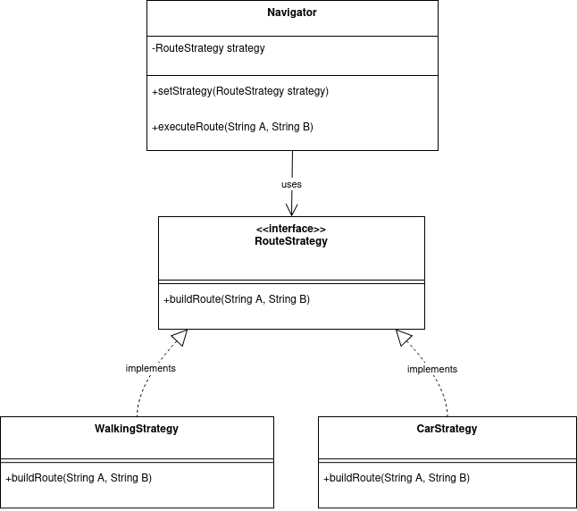
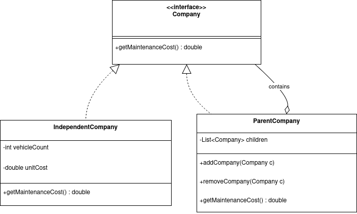
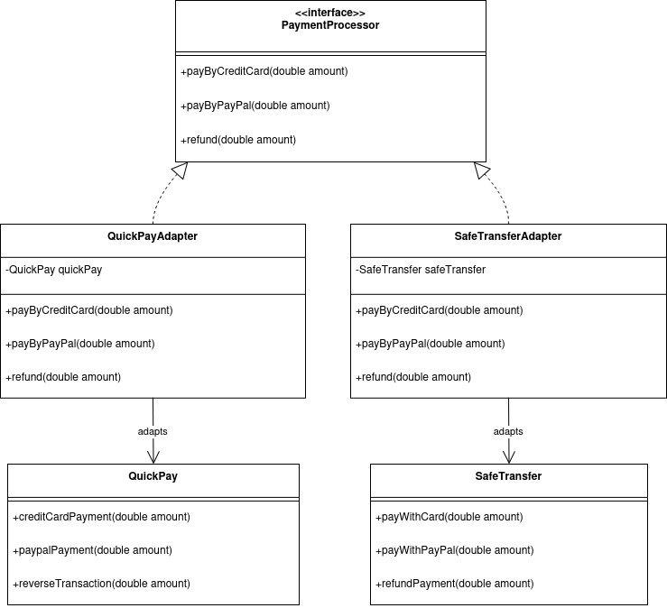
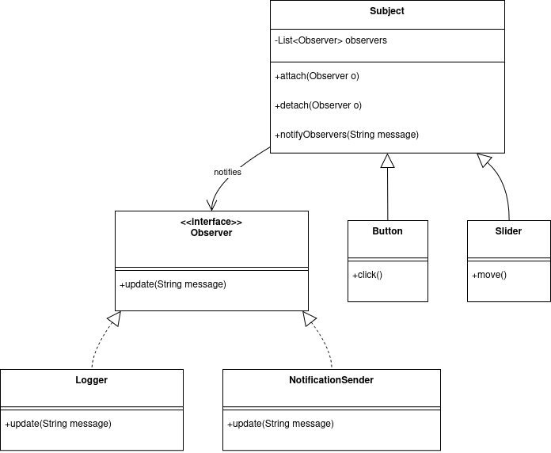

# Practical Report: Design Patterns Part 2

**Subject:** Software Engineering / Design Patterns 

---

## Exercise 1: Flexible Navigation with the Strategy Pattern

### 1. Conceptual Analysis
**Context:** We are building a Navigation System where the routing algorithm (Walking, Car, etc.) needs to be interchangeable at runtime.

1. **Role of the Navigator Class:**  
   The `Navigator` acts as the **Context** participant in the Strategy Pattern.  
   It maintains a reference to a `RouteStrategy` and delegates the route calculation to it, rather than implementing the algorithm itself.

2. **Why Navigator depends on the RouteStrategy interface:**  
   It depends on the interface to decouple the high-level `Navigator` from low-level algorithms.  
   This allows the strategy to be swapped at runtime without modifying the Navigator's code.

3. **SOLID Principles Applied:**  
   * **Open/Closed Principle:**  
     We can add new strategies without modifying existing Navigator code.  
   * **Single Responsibility Principle:**  
     Routing logic is encapsulated in specific strategy classes.

### 2. Class Diagram

<div style="background:white; display:inline-block; padding:10px;">
  
</div>

### 3. Java Implementation

```java
// Strategy Interface
interface RouteStrategy {
    void buildRoute(String locationA, String locationB);
}

// Concrete Strategy: Walking
class WalkingStrategy implements RouteStrategy {
    @Override
    public void buildRoute(String locationA, String locationB) {
        System.out.println("Calculating walking route from " + locationA + " to " + locationB);
    }
}

// Concrete Strategy: Car
class CarStrategy implements RouteStrategy {
    @Override
    public void buildRoute(String locationA, String locationB) {
        System.out.println("Calculating car route from " + locationA + " to " + locationB);
    }
}

// Context: Navigator
class Navigator {
    private RouteStrategy routeStrategy;

    public void setRouteStrategy(RouteStrategy routeStrategy) {
        this.routeStrategy = routeStrategy;
    }

    public void executeRoute(String A, String B) {
        if (routeStrategy == null) {
            System.out.println("Strategy not set.");
        } else {
            routeStrategy.buildRoute(A, B);
        }
    }
}
```

---

## Exercise 2: Vehicle Maintenance (Composite Pattern)

### 1. Conceptual Analysis

**Context:**  
Companies can be Independent or Parent Companies containing subsidiaries.  
We must treat both uniformly.

**Selected Pattern:** **Composite Pattern**  
**Reason:** Allows uniform treatment of individual objects and compositions.

### 2. Class Diagram

<div style="background:white; display:inline-block; padding:10px;">
  
</div>

### 3. Java Implementation

```java
import java.util.ArrayList;
import java.util.List;

// Component Interface
interface Company {
    double getMaintenanceCost();
}

// Leaf: Independent Company
class IndependentCompany implements Company {
    private int vehicleCount;
    private double unitCost;

    public IndependentCompany(int vehicleCount, double unitCost) {
        this.vehicleCount = vehicleCount;
        this.unitCost = unitCost;
    }

    @Override
    public double getMaintenanceCost() {
        return vehicleCount * unitCost;
    }
}

// Composite: Parent Company
class ParentCompany implements Company {
    private List<Company> subsidiaries = new ArrayList<>();

    public void addCompany(Company company) {
        subsidiaries.add(company);
    }

    public void removeCompany(Company company) {
        subsidiaries.remove(company);
    }

    @Override
    public double getMaintenanceCost() {
        double totalCost = 0;
        for (Company c : subsidiaries) {
            totalCost += c.getMaintenanceCost();
        }
        return totalCost;
    }
}
```

---

## Exercise 3: Payment Integration (Adapter Pattern)

### 1. Conceptual Analysis

**Context:** The system expects a `PaymentProcessor` interface but must integrate `QuickPay` and `SafeTransfer`, which have incompatible APIs.

**Pattern:** Adapter Pattern  
**Reason:** Wraps third-party classes to match an expected interface.

### 2. Class Diagram

<div style="background:white; display:inline-block; padding:10px;">
  
</div>

### 3. Java Implementation

```java
// Target Interface
interface PaymentProcessor {
    void payByCreditCard(double amount);
    void payByPayPal(double amount);
    void refund(double amount);
}

// Adapter for QuickPay
class QuickPayAdapter implements PaymentProcessor {
    private QuickPay quickPay;

    public QuickPayAdapter(QuickPay quickPay) {
        this.quickPay = quickPay;
    }

    @Override
    public void payByCreditCard(double amount) {
        quickPay.creditCardPayment(amount);
    }

    @Override
    public void payByPayPal(double amount) {
        quickPay.paypalPayment(amount);
    }

    @Override
    public void refund(double amount) {
        quickPay.reverseTransaction(amount);
    }
}

// Adapter for SafeTransfer
class SafeTransferAdapter implements PaymentProcessor {
    private SafeTransfer safeTransfer;

    public SafeTransferAdapter(SafeTransfer safeTransfer) {
        this.safeTransfer = safeTransfer;
    }

    @Override
    public void payByCreditCard(double amount) {
        safeTransfer.payWithCard(amount);
    }

    @Override
    public void payByPayPal(double amount) {
        safeTransfer.payWithPayPal(amount);
    }

    @Override
    public void refund(double amount) {
        safeTransfer.refundPayment(amount);
    }
}
```

---

## Exercise 4: GUI Dashboard (Observer Pattern)

### 1. Conceptual Analysis

**Context:** Buttons and sliders notify multiple observers when they change state.

**Pattern:** Observer Pattern  
**Reason:** Manages a one-to-many dependency automatically.

### 2. Class Diagram

<div style="background:white; display:inline-block; padding:10px;">
  
</div>

### 3. Java Implementation

```java
import java.util.ArrayList;
import java.util.List;

// Observer Interface
interface Observer {
    void update(String message);
}

// Subject Class
class Subject {
    private List<Observer> observers = new ArrayList<>();

    public void attach(Observer o) {
        observers.add(o);
    }

    public void detach(Observer o) {
        observers.remove(o);
    }

    protected void notifyObservers(String message) {
        for (Observer o : observers) {
            o.update(message);
        }
    }
}

// Concrete Subject: Button
class Button extends Subject {
    private String name;
    
    public Button(String name) {
        this.name = name;
    }

    public void click() {
        notifyObservers("Button " + name + " clicked.");
    }
}

// Concrete Subject: Slider
class Slider extends Subject {
    private String name;

    public Slider(String name) {
        this.name = name;
    }

    public void move() {
        notifyObservers("Slider " + name + " moved.");
    }
}

// Concrete Observer: Logger
class Logger implements Observer {
    @Override
    public void update(String message) {
        System.out.println("Logger: " + message);
    }
}

// Concrete Observer: NotificationSender
class NotificationSender implements Observer {
    @Override
    public void update(String message) {
        System.out.println("NotificationSender: Alert! " + message);
    }
}
```

