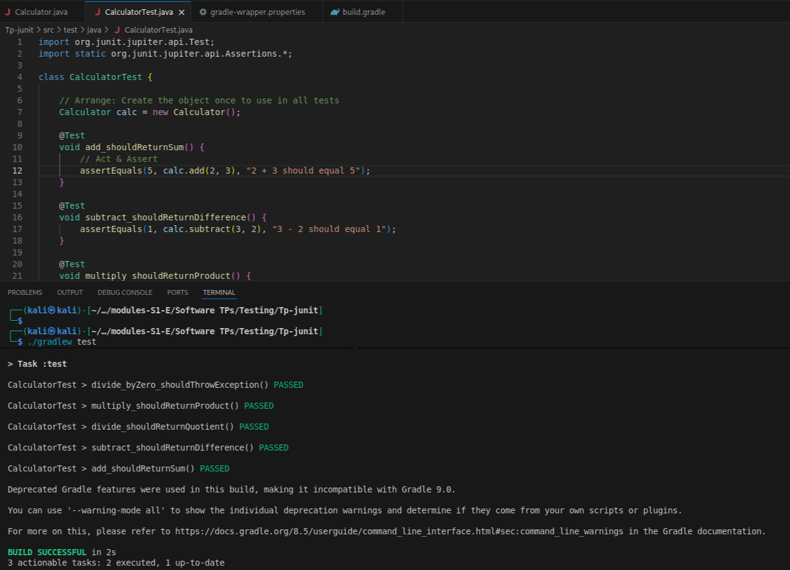
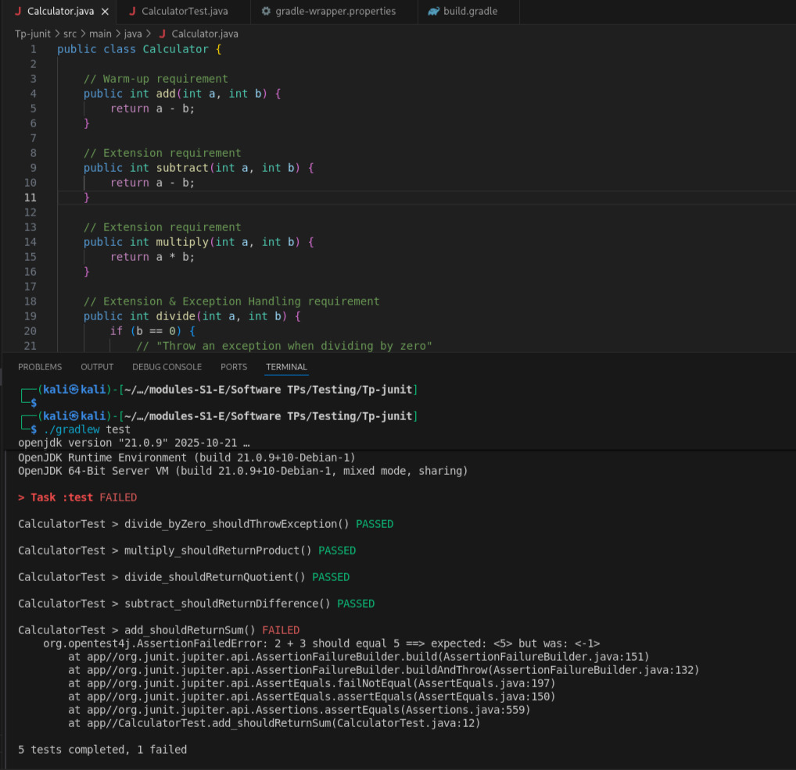

---

# **Practical Work Report: Software Testing (Exercise 1)**

**Subject:** Software Testing & Quality Assurance
**Topic:** Unit Testing with JUnit 5, Gradle, and VS Code
**Date:** November 26, 2025

---

## **1. Introduction & Objective**

The objective of this practical work is to set up a unit testing environment using **JUnit 5** and **Gradle** in **Visual Studio Code**.
The primary task is to:

* implement a `Calculator` class,
* apply the **Arrange–Act–Assert (AAA)** pattern,
* and verify the tests against various failure scenarios (Assertion errors and Logic regressions).

---

## **2. Environment Configuration**

To support **Java 21**, the project was migrated from **Gradle 4.4.1** to **Gradle 8.5**.
The `build.gradle` file was configured to use the **JUnit 5 platform**.

### **File: `build.gradle`**

```gradle
plugins {
    id 'java'
}

group = 'com.example'
version = '1.0-SNAPSHOT'

repositories {
    mavenCentral()
}

dependencies {
    testImplementation platform('org.junit:junit-bom:5.10.0')
    testImplementation 'org.junit.jupiter:junit-jupiter'
}

test {
    useJUnitPlatform()
    testLogging {
        events "passed", "skipped", "failed"
        exceptionFormat "full"
        showStandardStreams = true
    }
}
```

---

## **3. Implementation Code**

The `Calculator` class implements basic arithmetic operations.
It includes exception handling for **division by zero**, as required by the TP specifications.

### **File: `src/main/java/Calculator.java`**

```java
public class Calculator {

    public int add(int a, int b) {
        return a + b;
    }

    public int subtract(int a, int b) {
        return a - b;
    }

    public int multiply(int a, int b) {
        return a * b;
    }

    public int divide(int a, int b) {
        if (b == 0) {
            throw new ArithmeticException("Cannot divide by zero");
        }
        return a / b;
    }
}
```

---

## **4. Test Suite Implementation**

The tests follow the **AAA (Arrange, Act, Assert)** pattern.

### **File: `src/test/java/CalculatorTest.java`**

```java
import org.junit.jupiter.api.Test;
import static org.junit.jupiter.api.Assertions.*;

class CalculatorTest {

    Calculator calc = new Calculator();

    @Test
    void add_shouldReturnSum() {
        assertEquals(5, calc.add(2, 3), "2 + 3 should equal 5");
    }

    @Test
    void subtract_shouldReturnDifference() {
        assertEquals(1, calc.subtract(3, 2), "3 - 2 should equal 1");
    }

    @Test
    void multiply_shouldReturnProduct() {
        assertEquals(6, calc.multiply(2, 3), "2 * 3 should equal 6");
    }

    @Test
    void divide_shouldReturnQuotient() {
        assertEquals(2, calc.divide(6, 3), "6 / 3 should equal 2");
    }

    @Test
    void divide_byZero_shouldThrowException() {
        assertThrows(ArithmeticException.class, () -> {
            calc.divide(1, 0);
        }, "Dividing by zero should throw ArithmeticException");
    }
}
```

---

## **5. Execution Results & Analysis**

Three distinct test runs were performed to validate the testing framework.

---

### **Scenario A: Successful Build**

* **Condition:** The code is correct (`a + b`) and the test expects the correct result (5).
* **Result:** All 5 tests passed.

> *Figure 1:* Terminal showing **BUILD SUCCESSFUL** with all tasks passing.


---

### **Scenario B: Assertion Verification (Intentional Failure)**

* **Condition:** The test expectation was intentionally changed to **15** (`assertEquals(15, ...)`), while the code correctly returned **5**.
* **Goal:** Verify that JUnit reports the discrepancy between *Expected* and *Actual*.

> *Figure 2:* Terminal showing **AssertionFailedError** with
> *expected: `<15>` but was: `<5>`*.



---

### **Scenario C: Regression Testing (Simulated Bug)**

* **Condition:** As per Step 6 of the TP, a bug was introduced by changing `add` to return `a - b`.
* **Goal:** Verify that unit tests can detect logic regressions.

> *Figure 3:* Terminal showing failure in `add_shouldReturnSum`.
> Expected **5** but returned **–1**.


---

## **6. Conclusion**

The Gradle environment in VS Code was successfully configured, and the required Calculator module was implemented.
The unit tests validate the logic correctly and are capable of detecting:

* incorrect assertions,
* logic errors,
* and regressions in the source code.

---

